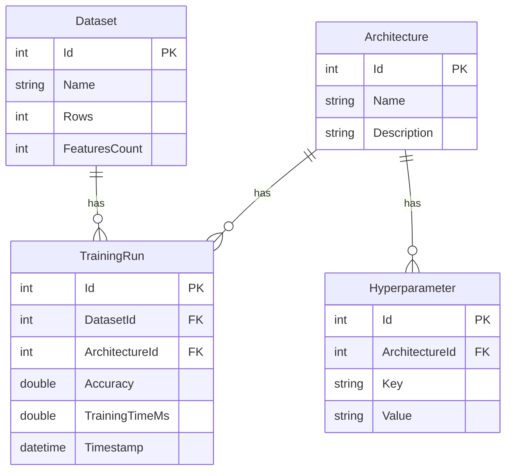

# MLOps Dashboard: Experiment Tracker & Leaderboard

## Author
**Hubert Szewczyk**

**GitHub:** [Ertzyk](https://github.com/Ertzyk)

## Description
MLOps Dashboard is a local, lightweight web application built with ASP.NET Core MVC and SQLite. It acts as an experiment tracker for Machine Learning workflows. The application allows users to log different datasets, track various neural network or classical algorithm architectures, record specific hyperparameters, and log the final accuracy and training time of individual training runs. 

Instead of manually tracking ML experiments in spreadsheets, this dashboard provides a structured, relational database interface to compare model performance efficiently.

## Core Functionalities
The application utilizes Entity Framework Core with an underlying SQLite database consisting of 4 fully relational tables (`Dataset`, `Architecture`, `Hyperparameter`, `TrainingRun`).



* **Relational CRUD Operations:** Full Create, Read, Update, and Delete capabilities for all entities via the web interface. Foreign keys are seamlessly resolved in the UI to display human-readable names instead of raw database IDs.
* **Automated Data Seeding:** Upon the first launch, the application automatically seeds the SQLite database with a highly realistic mock dataset (e.g., MNIST, S&P 500 Daily Options, CIFAR-10) using EF Core's `HasData` method.
* **Dynamic Performance Leaderboard:** The Home page features a custom LINQ-aggregated leaderboard. It dynamically groups all training runs by their respective datasets and displays only the architecture that achieved the highest peak accuracy, alongside its training time.
* **UI:** The interface utilizes the Bootswatch "Darkly" theme for a sleek, dark-mode developer experience, complete with formatted floating-point math for precision accuracy displays.
* **Seamless Navigation:** All views and tables are fully accessible via the top navigation bar.

## How to Run / Usage

**Prerequisites:**
* .NET 8.0 SDK (or newer)

**Execution Steps:**
1. Clone the repository to your local machine.
2. Open a terminal in the root directory of the project.
3. Apply the migrations to generate and seed the `mlops.db` file:
   ```bash
   dotnet ef database update
   ```
4. Run the application:
    ```bash
    dotnet run
    ```
5. Open your web browser and navigate to the localhost port provided in the terminal (e.g., http://localhost:5207)
6. Use the top navigation menu to add new datasets, configure architectures, and log new training runs. The Home page will automatically update to reflect the best-performing models.