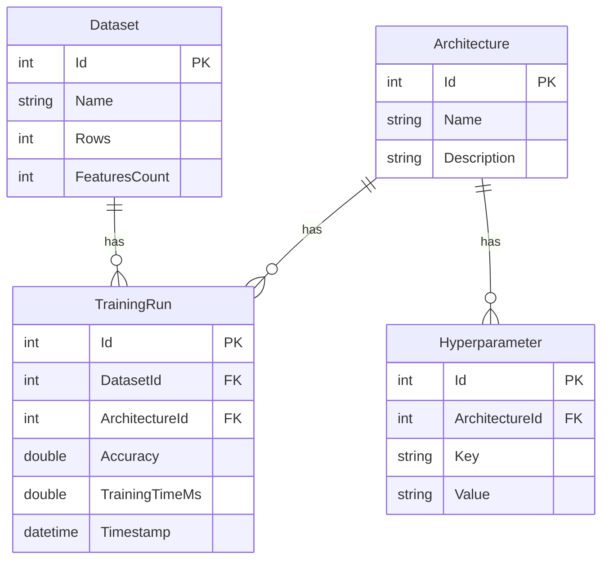

# MLOps Dashboard: Śledzenie Eksperymentów i Ranking

## Autor
**Hubert Szewczyk**

## Opis
MLOps Dashboard to lokalna, lekka aplikacja internetowa zbudowana w technologii ASP.NET Core MVC oraz z wykorzystaniem bazy SQLite. Pełni ona funkcję narzędzia do śledzenia eksperymentów dla przepływów pracy związanych z uczeniem maszynowym. Aplikacja pozwala użytkownikom rejestrować różne zbiory danych, śledzić rozmaite architektury sieci neuronowych lub klasycznych algorytmów, zapisywać konkretne hiperparametry oraz rejestrować końcową dokładność i czas trenowania poszczególnych przebiegów.

Zamiast ręcznego śledzenia eksperymentów ML w arkuszach kalkulacyjnych, aplikacja ta zapewnia ustrukturyzowany interfejs oparty na relacyjnej bazie danych do efektywnego porównywania wyników różnych modeli.

## Główne Funkcjonalności
Aplikacja wykorzystuje Entity Framework Core z bazą danych SQLite składającą się z 4 w pełni relacyjnych tabel (`Dataset`, `Architecture`, `Hyperparameter`, `TrainingRun`).



* **Relacyjne Operacje CRUD:** Pełne możliwości tworzenia, odczytu, aktualizacji i usuwania (CRUD) dla wszystkich encji za pośrednictwem interfejsu webowego. Klucze obce są automatycznie obsługiwane przez interfejs użytkownika, wyświetlając czytelne dla człowieka nazwy zamiast surowych identyfikatorów bazy danych.
* **Zautomatyzowane Zasilanie Danych (Seeding):** Przy pierwszym uruchomieniu, aplikacja automatycznie dodaje do bazy SQLite wysoce realistyczne, przykładowe dane (np. zbiory MNIST, S&P 500 Daily Options, CIFAR-10) przy użyciu metody `HasData` frameworka EF Core.
* **Dynamiczny Ranking Wydajności (Zestawienie):** Strona główna zawiera niestandardowy ranking generowany za pomocą zapytań grupujących LINQ. Dynamicznie grupuje on wszystkie przebiegi trenowania według ich odpowiednich zbiorów danych i wyświetla wyłącznie tę architekturę, która osiągnęła najwyższą szczytową dokładność, wraz z jej czasem trenowania.
* **UI:** Interfejs wykorzystuje motyw "Darkly" z biblioteki Bootswatch, zapewniając nowoczesny i czytelny wygląd w trybie ciemnym, wzbogacony o precyzyjne formatowanie liczb zmiennoprzecinkowych dla wyświetlanych wskaźników dokładności.
* **Płynna Nawigacja:** Wszystkie widoki i tabele są w pełni dostępne z poziomu górnego paska nawigacyjnego bez konieczności ręcznego wpisywania adresów URL.

## Jak Uruchomić / Instrukcja Obsługi

**Wymagania wstępne:**
* .NET 8.0 SDK (lub nowszy)

**Kroki uruchomienia:**
1. Sklonuj repozytorium na swój komputer lokalny.
2. Otwórz terminal w głównym katalogu projektu.
3. Zaaplikuj migracje, aby wygenerować i zasilić plik `mlops.db`:
   ```bash
   dotnet ef database update
   ```
4. Uruchom aplikację:

    ```bash
    dotnet run
    ```
5. Otwórz przeglądarkę internetową i przejdź pod adres lokalny podany w terminalu (np. http://localhost:5207).

6. Używaj górnego menu nawigacyjnego do dodawania nowych zbiorów danych, konfigurowania architektur i rejestrowania nowych wyników trenowania. Strona główna (zestawienie) zaktualizuje się automatycznie, odzwierciedlając modele o najlepszych wynikach.